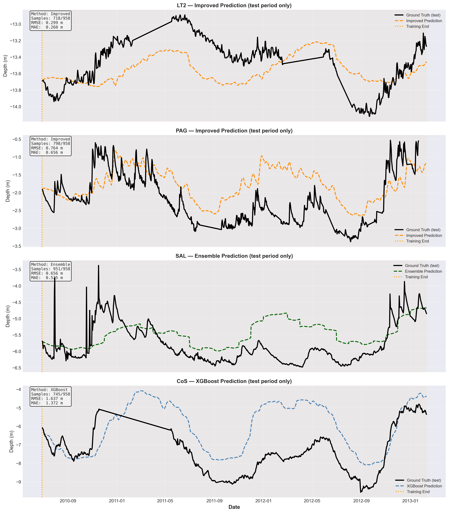

# Predictioneer: Groundwater Time Series Forecasting

## Overview

This project presents a comprehensive solution for **long-horizon groundwater depth forecasting** across multiple aquifers. The challenge involves predicting groundwater levels over a **2.6-year period** (June 2010 – February 2013) using only historical observations, without access to future exogenous variables like rainfall or pumping data.

*Figure: Final model predictions (test period) compared against ground truth for all four aquifer targets. Each subplot shows the selected best-performing method for that specific aquifer.*

---

## Problem Context

### Dataset Characteristics

- **Temporal Coverage**: March 1998 – June 2010 (~12 years of historical data)
- **Targets**: Four groundwater depth measurements (LT2, SAL, PAG, CoS)
- **Challenges**:
  - Unequal historical record lengths across targets
  - Substantial missing data in early periods (63-88% missing for some targets)
  - Strong annual seasonal cycles
  - Gradual long-term trends that differ by aquifer
  - No future exogenous predictors available

### Key Constraints

- **Prediction Horizon**: 958 days (~2.6 years)
- **Last Training Date**: June 28, 2010
- **Prediction Period**: June 29, 2010 – February 10, 2013
- **Physical Constraint**: Groundwater depths must remain negative (below ground surface)

---

## Modeling Approach

Rather than applying a single model to all targets, this project adopts a **target-specific model selection strategy** after systematic experimentation with multiple forecasting methods.

### Methods Explored

1. **Seasonal Decomposition + Trend Projection (Baseline)**
   - Explicit trend and seasonal component modeling
   - Damped long-term trend extrapolation
   - Conservative, interpretable baseline

2. **Facebook Prophet**
   - Automatic seasonality and changepoint detection
   - Additive seasonal components
   - Risk of unrealistic extrapolation for limited data

3. **Improved STL-Based Model**
   - STL (Seasonal-Trend decomposition using LOESS) at daily resolution
   - Damped mean-reverting trends
   - Controlled residual-based variability
   - Physical constraint enforcement

4. **XGBoost with Cyclical Features**
   - Gradient boosting with engineered time features
   - Sine/cosine encodings for seasonality
   - Bias-corrected for level continuity

5. **Ensemble Methods**
   - Variable-specific weighted combinations
   - Incorporates strengths of multiple approaches

---

## Final Model Selection

Based on comprehensive evaluation against ground truth, the following models were selected per target:

| Target | Method | Rationale |
|--------|--------|-----------|
| **LT2** | Improved STL | Best balance of trend continuity, seasonal fidelity, and physical plausibility |
| **PAG** | Improved STL | Most conservative approach for short historical record; avoids overfitting |
| **SAL** | Original Ensemble | Optimal balance between seasonal structure and trend stability |
| **CoS** | XGBoost (bias-corrected) | Captures strong nonlinearity and variability effectively |

---

## Performance Metrics

### Per-Target Results (Test Period)

| Target | Method | RMSE (m) | MAE (m) | Samples |
|--------|--------|----------|---------|---------|
| **LT2** | Improved | 0.299 | 0.260 | 718/958 |
| **PAG** | Improved | 0.764 | 0.656 | 798/958 |
| **SAL** | Ensemble | 0.656 | 0.525 | 951/958 |
| **CoS** | XGBoost | 1.637 | 1.372 | 745/958 |

### Overall Performance

- **Average RMSE**: 0.84 m
- **Average MAE**: 0.70 m

**Key Observations**:
- LT2 shows the best performance due to longest, most complete historical record
- CoS exhibits highest errors due to large-amplitude seasonal swings and complex dynamics
- All predictions respect physical constraints (negative depths)
- Forecasts maintain smooth continuity at training-test boundary
---

## Detailed Documentation

For complete implementation details, exploratory data analysis, model comparisons, and step-by-step methodology, please refer to the **[full implementation notebook](predictioneer_groundwater_forecasting.ipynb)**.

The notebook contains:
- Comprehensive EDA with visualizations
- Detailed explanation of each forecasting method
- Model training and evaluation code
- Cross-method comparisons
- Physical constraint implementation
- Complete reproducible pipeline

